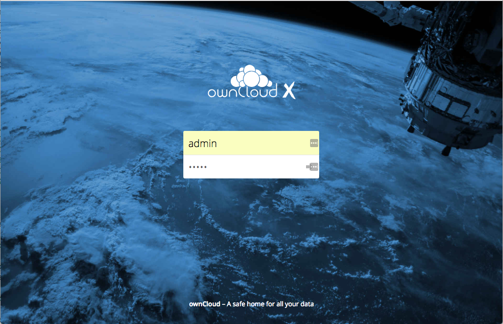

## Prerequisites

* [Docker](https://docs.docker.com/install/)
* [Docker Compose](https://docs.docker.com/compose/install/)
* Review the ownCloud [System Requirements](https://doc.owncloud.org/server/latest/admin_manual/installation/system_requirements.html)


## Install ownCloud Using Docker

You can use the [ownCloud Docker image](https://hub.docker.com/r/owncloud/server/) to install ownCloud using Docker. This image is designed to work with a data volume in the host file system, and with separate MariaDB and Redis containers. This configuration:

* Exposes port 8080 for HTTP connections
* Mounts the data and MySQL data directories on the host for persistent storage


1. Run the following commands to create and switch to a new project directory.

   ```
   mkdir owncloud-docker-server
   cd owncloud-docker-server
   ```

2. Download the `docker-compose.yml` file from the ownCloud GitHub repository. For example:

   `wget https://raw.githubusercontent.com/owncloud-docker/server/master/docker-compose.yml`

3. Create a `.env` environment configuration file with the following required settings.

   | **Setting Name**     | **Description**          | **Example** |
   |----------------------|--------------------------|-------------|
   | OWNCLOUD_VERSION     | The ownCloud version     | latest      |
   | OWNCLOUD_DOMAIN      | The ownCloud domain      | localhost   |
   | ADMIN_USERNAME       | Admin user name          | admin       |
   | ADMIN_PASSWORD       | Admin password           | admin       |
   | HTTP_PORT            | The HTTP port            | 8080        |

   For example:

   ```
   cat << EOF > .env
   OWNCLOUD_VERSION=10.0
   OWNCLOUD_DOMAIN=localhost
   ADMIN_USERNAME=admin
   ADMIN_PASSWORD=admin
   HTTP_PORT=8080
   EOF
   ```

4. Build and start the container:

   `docker-compose up -d`

5. When this process completes, run the following command to confirm that all of the containers have started successfully.

   `docker-compose ps`

   If the containers are running, this command should return a response similar to the following:

   ```
    Name                     Command               State                     Ports
   -------------------------------------------------------------------------------------------------------
   server_db_1         /usr/bin/entrypoint /bin/s ...   Up      3306/tcp
   server_owncloud_1   /usr/local/bin/entrypoint  ...   Up      0.0.0.0:8080->8080/tcp
   server_redis_1      /bin/s6-svscan /etc/s6           Up      6379/tcp
   ```
   **Note:**
   Even though all of the containers are running, it may take a few minutes for ownCloud to be fully functional. If you run `docker-compose logs --follow owncloud` and see a significant amount of information logging to the console, that indicates that the web UI may not be accessible yet.

6. Use a browser to log in to the ownCloud UI at http://localhost:8080. Enter the user name and password you specified in the `.env` file.

 
