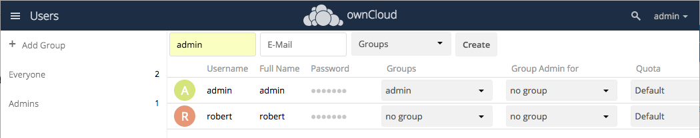

**Note:** Only admin users can add or modify ownCloud users.

## Add a New User

1. Click your user name at the top right of the ownCloud UI, then select **Users**.

   

2. On the Users page, enter a user name and email address for the new user, and optionally specify group assignments. Click **Create** to create the new user.

   

3. The new user appears in the list on the Users page. If you have [configured an email server](https://doc.owncloud.org/server/latest/admin_manual/configuration/server/email_configuration.html), an email with login information is sent to the new user.

   

## Reset a User Password

1. Click the edit icon next to the user's password field.  name at the top right of the ownCloud UI, then select **Users**.

   

2. Type in a new password, then press the Enter key. A message at the top of the page confirms that the password has been changed.  

        

**Related Information**

* [ownCloud User Management Guide](https://doc.owncloud.org/server/latest/admin_manual/configuration/user/)  
