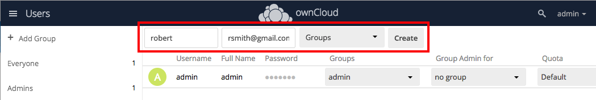

## Add a New User

1. Click your user name at the top right of the ownCloud UI, then select **Users**.

   

2. On the Users page, enter a user name and intial password for the new user, and optionally specify Groups assignments. Click **Create** to create the new user.

   

3. The new user appears in the list on the Users page, and an email with login information is sent to the new user.

   

**Related Information**

* [ownCloud User Management Guide](https://doc.owncloud.org/server/latest/admin_manual/configuration/user/)  
