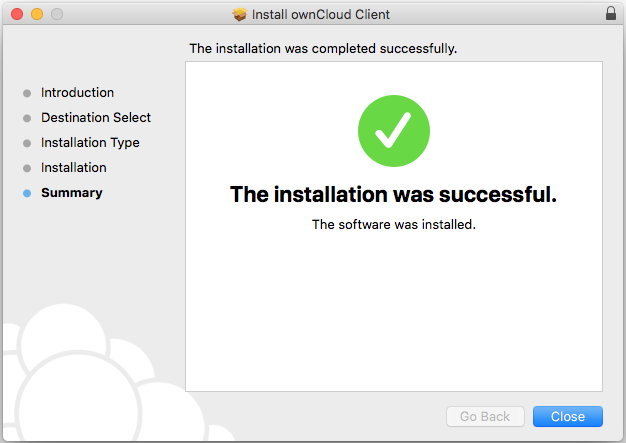
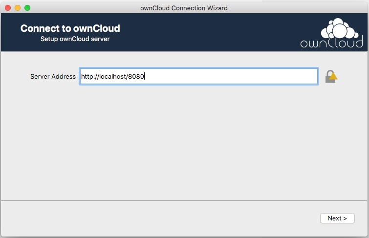
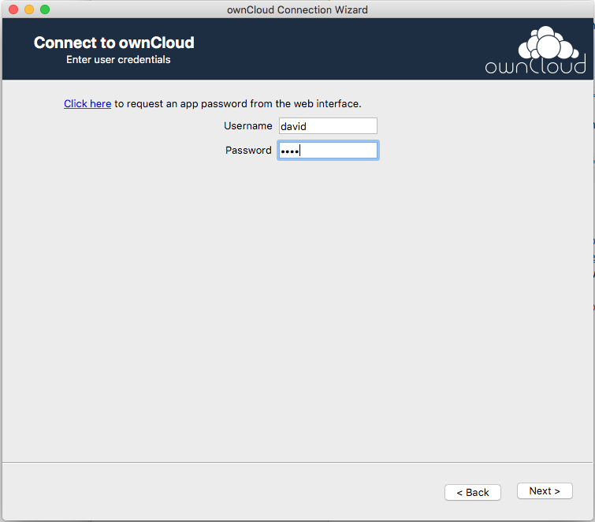
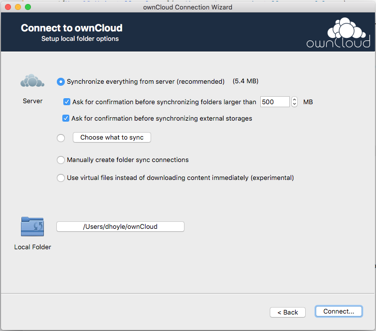
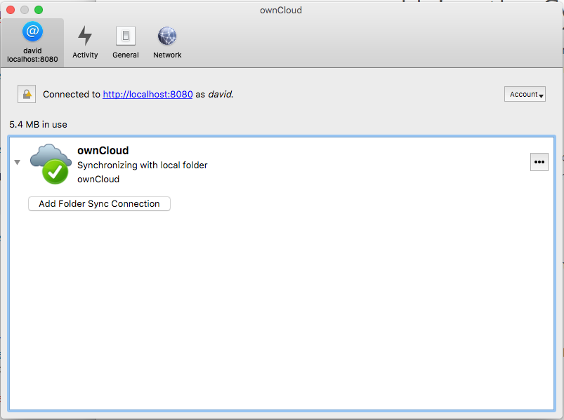
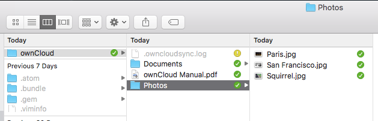

## Connecting to ownCloud Using Desktop Clients

### Mac OS X

1. Download the latest production version of the Mac OS X desktop client from the [ownCloud Server Downloads](https://owncloud.org/download/) page.

2. Open the downloaded .pkg file to launch the ownCloud client installer, then click through the installer steps. When the installation has completed successfully, click **Close**.   

   

3. In the Applications folder, open **owncloud**. The ownCloud connection wizard appears. Enter the ownCloud server address in the **Server Address** box, then click **Next**.

   

4. On the next screen, enter your ownCloud user name and password, then click **Next**.

   

5. On the next screen, accept the default local folder options, then click **Connect**.

      

6. When the connection wizard successfully connects to the ownCloud server, the synchronization client appears.

   

7. You can now use Finder to browse to the local ownCloud folder you specified in the connection wizard. This folder is synchronized with the ownCloud server.

   

8. For more information, see [Using the Synchronization Client](https://doc.owncloud.org/desktop/latest/navigating.html).

### Windows

See [Installing the Desktop Synchronization Client](https://doc.owncloud.org/desktop/latest/installing.html) for instructions on installing and connecting the ownCloud desktop client for Microsoft Windows.  

## Connecting to ownCloud Using Mobile Clients

The following resources provide information about ownCloud synchronization clients for iOS and Android devices.

* [ownCloud Mobile App Downloads](https://owncloud.org/download/#owncloud-mobile-apps)
* [ownCloud iOS App Manual](https://doc.owncloud.org/ios/ios_app.html)
* [ownCloud Android App Manual](https://doc.owncloud.org/android/android_app.html)
